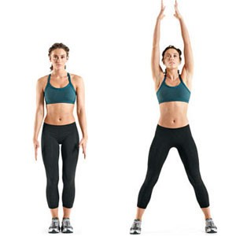
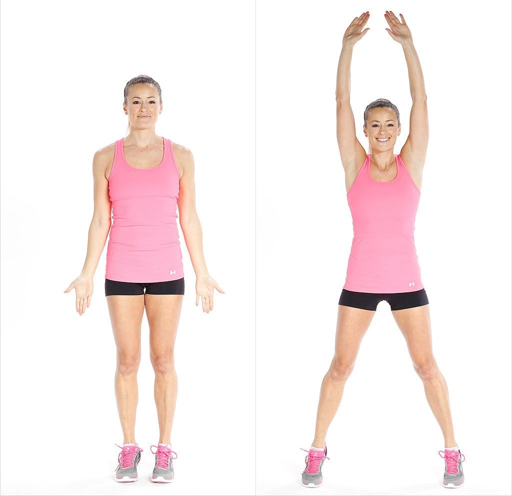

```{r setup, include=FALSE}
knitr::opts_chunk$set(echo = FALSE, warning = FALSE, message = FALSE)
```

*Task I*

*You will be working in groups on a quantified student project*

*Download the Sensor Kinetics Pro app to your iOS or Android device (or similar gyroscope measuring app)*

*Split into subgroups with each subgroup investigating one measures available in the app*

*Each subgroup should report back after 20min with what they have learned*

*Task II*

*1. In consultation with your group select a physical activity that: a) can be measured using the app, b) has a concrete, continuous, countable outcome and c) some members of the group are experts and some are novices at. Describe your project:*

**The physical activity we choose was jumping jacks. We measured how many jumping jacks we did in 30 seconds during the Hackathon on December 2nd, 2020. While we did jumping jacks, we held a cell phone in our right hand to record the movement data.**

*2. Collect measurements for all members of the group performing the task using the app*

**In this project, we used the App "Physics Toolbox Sensor Suite". We used the gyroscope function in the app to record position change while we were performing jumping jacks in 30 seconds.**

*3. Create a Github repo where you can store and share your data*

https://github.com/zjf2003tc/Assignment6_JumpingJacks


```{r}
# reading in files and packages

library(dplyr)
library(tidyr)
library(ggplot2)
library(GGally)
library(formattable)

#import data
DFge<-read.csv("sensor_Ge.csv")
DFlee<-read.csv("sensor_lee.csv")
DFye<-read.csv("sensor_ye.csv")
DFzhang<-read.csv("sensor_Zhang.csv")
DFfriedman<-read.csv("sensor_friedman.csv")
DFzhao<-read.csv("sensor_zhao.csv")
DFdanny<-read.csv("Danny sensor.csv") 
DFsang<-read.csv("sensor_Sang.csv")


```

## Merging and Cleaning data

```{r}
# scrubbing Sang's data because she used a different app.

DFsang <- DFsang %>% separate(Date.Timestamp.DeviceOrientation.GyroscopeX.GyroscopeY.GyroscopeZ.Label,c("Date","Date2","Date3","Date4","Date5","Date6","Timestamp","Timestamp2","DeviceOrientation","GyroscopeX","GyroscopeX2","GyroscopeY","GyroscopeY2","GyroscopeZ","GyroscopeZ2","Label",sep = ";")) %>% .[,-c(1:6,16:18)] %>% unite("time",c(Timestamp,Timestamp2),sep = ".") %>% unite("wx",c(GyroscopeX,GyroscopeX2),sep = ".")%>% unite("wy",c(GyroscopeY,GyroscopeY2),sep = ".")%>% unite("wz",c(GyroscopeZ,GyroscopeZ2),sep = ".") %>% .[,-2]
DFsang[,1:4] <- DFsang[,1:4] %>% mutate_all(as.double)
DFsang <- DFsang %>% mutate(time = time - 1606876533)
```

```{r}
# scrubbing Lee's data because he had 4 times as many measurements over the 30 second period
DFlee <- DFlee %>% filter(between(time,1,31)) %>%  .[seq(1, nrow(DFlee), 4), ]
```

```{r}
# merging CSVs into one file and removing Sang's data because it was too irregular

DFge$name<-c("ge")
DFlee$name<-c("lee")
DFye$name<-c("ye")
DFzhang$name<-c("zhang")
DFfriedman$name<-c("friedman")
DFzhao$name<-c("zhao")
DFdanny$name<-c("danny")
DFsang$name<-c("sang")

colnames(DFlee)<-c("time","wx","wy","wz","name" )
DF <- rbind(DFge, DFlee,DFye,DFzhang,DFfriedman,DFzhao,DFdanny)
DF <- DF %>% filter(between(time,1,31))
```


#### Below is the data table with all the engineered features of position data. "sum.diff.(x,y,z)" was calculated by taking the sum of the absolute value of the difference between the lead row (one measurement ahead) and the current row. Thus, it represents the total change in gyroscope vectors for each position. The other features are standard statistical measures.

```{r}
# Create several new variables in all three dimensions: standard deviation, range, and average position

DF1 <- DF %>% group_by(name) %>% summarize(max.x = max(wx),min.x = min(wx),average.x = mean(wx),sd.x = sd(wx),max.y = max(wy),min.y = min(wy),average.y = mean(wy),sd.y = sd(wy),max.z = max(wz),min.z = min(wz),average.z = mean(wz),sd.z = sd(wz)) %>% mutate(range.x = max.x-min.x,range.y = max.y-min.y,range.z = max.z-min.z) %>% select(-c(max.x,min.x,max.y,min.y,max.z,min.z))

# Create new variables in all three dimensions: total change in position

DF.new <- DF %>% group_by(name) %>% mutate(diff.x = abs(lead(wx)-wx),diff.y = abs(lead(wy)-wy),diff.z = abs(lead(wz)-wz)) %>% summarize(sum.diff.x = sum(diff.x,na.rm = T),sum.diff.y = sum(diff.y,na.rm = T),sum.diff.z = sum(diff.z,na.rm = T)) %>% left_join(DF1,by = "name")

# DF %>% group_by(name) %>% count

DF.new %>% mutate_at(vars(-name), funs(round(., 2))) %>% formattable()
```


#### The ten most highly correlated pairs of variables are listed below Standard Deviation, range, and sum of positions seem to be highly correlated in all of the dimensions.

```{r}
# use correlation function to find the 10 most highly correlated pairs of variables

df <- DF.new[,-1]
corr_simple <- function(data=df,sig=0.3){
  #convert data to numeric in order to run correlations
  #convert to factor first to keep the integrity of the data - each value will become a number rather than turn into NA
  df_cor <- data %>% mutate_if(is.character, as.factor)
  df_cor <- df_cor %>% mutate_if(is.factor, as.numeric)
  #run a correlation and drop the insignificant ones
  corr <- cor(df_cor)
  #prepare to drop duplicates and correlations of 1     
  corr[lower.tri(corr,diag=TRUE)] <- NA
  #drop perfect correlations
  corr[corr == 1] <- NA
  #turn into a 3-column table
  corr <- as.data.frame(as.table(corr))
  #remove the NA values from above 
  corr <- na.omit(corr) 
  #select significant values  
  corr <- subset(corr, abs(Freq) > sig) 
  #sort by highest correlation
  corr <- corr[order(-abs(corr$Freq)),]
  #print table
  corr %>% head(1000)
}
corr_simple() %>% head(10)%>% mutate_at(vars(-Var1,-Var2), funs(round(., 3))) %>% select(Var1,Var2,Correlation = Freq) %>% arrange(-abs(Correlation)) %>% formattable()


```


## Kmeans Using Position Data


```{r}
dd1<-data.frame(DF.new)
dd2 <- dd1[,-1]
dd3<-scale(dd2, center = TRUE, scale = TRUE)
fitdd <- kmeans(dd3,2)
dd4<-data.frame(dd1,fitdd$cluster)

```


#### Below is a table of individuals sorted by number of jumping jacks performed and their respective clusters. There is no clear relationship between jumping jacks and cluster assignment.

```{r}
number30s<-read.csv("Jumping_Jacks_in_30s.csv")
names(number30s) <- c("name","jumping_jacks")

sr<-read.csv("SurveyResponse.csv")
names(sr)[1] <- "name"

dd5<-merge(dd4,number30s,by=c("name"))

dd5<-merge(dd5,sr,by=c("name"))

#numbers in 30s by how often perform jumping jacks
# qplot(Q2,jumping_jacks,col=as.factor(fitdd.cluster),data=dd5)

# DF.new %>% left_join(number30s,by = "name") %>% arrange(-jumping_jacks) %>% select(name,jumping_jacks,everything())

dd5 %>% select(name, jumping_jacks, fitdd.cluster) %>% arrange(-jumping_jacks) %>% mutate_at(vars(-name), funs(round(., 2))) %>% formattable()
```


*4. Using K-means, can you identify the novices from the experts using only the app data?*

**The resulting clusters grouped danny, zhao, and ye in one group, although danny and zhao had the second and third most jumping jacks, respectively, ye had the fewest. Thus, the clusters do not seem to be able to distinguish the novices from the experts.**

### Cluster visualization

*5. Visualize your results using ggplot2*


```{r}
# Visualize the relationship between Q5 (good jumping jack technique/form) with number of jumping jacks and see how the clusters are assigned. Jitter added to see overlapping points

dd5 %>% mutate(Cluster = as.factor(fitdd.cluster)) %>% ggplot + geom_jitter(mapping = aes(x= range.z,y = jumping_jacks,color = Cluster)) + labs(x = "Range of Position in the Z Direction", y = "Number of Jumping Jacks in 30 Seconds", title = "Clusters Visualized on Range.Z vs. Number of Jumping Jacks")
```

#### Above is a visualization of the relationship between range.z and number of jumping jacks. When replacing range.z with range.x, the graph looked very similar. Clearly, the clusters are a decent indicator of the x-axis, the raw gyroscope data.  However, the clusters do not show a clear relationship to the y-axis, the jumping jacks. Thus, this attempt at kMeans failed to provide strong predictive power for jumping jack ability. There are a couple potential reasons for this finding: 

**(1) The gyrsocope data did not accurately or consistently gauge important aspects of performing jacks quickly. Two of the dimensions, x and z, measured movements that were unrelated to the position of one's hand during a jumping jack. During a jumping jack, one does not bend their wrist up and down or shake their wrist, as in waving their hand. The y-dimension is an exception and will be discussed later. One other caveat to the unrelatedness of the gyroscope data is that the three vectors do spike in unison when one's hand quickly accelerates or decelerates, likely because the gyroscope is under so much angular force. So, it is still somewhat surprising that kMeans proved ineffective when using statistical measures of these three variables in the model.**

**(2) There are not enough data to identify experts based on this clustering method; there were only seven participants.**


## PCA: Predicting Using Survey Data

*Task III*

*1. Devise five questions on a five point Likert scale that ask members of your group about their experience with your chosen task. Collect data from all members of your group.*

**We  surveyed our group members and asked ourselves various questions related to our experience with jumping jacks and overall physical fitness. These were developed with the aim of differentiating novices and experts in the group.** 

**Q1.I consider myself physically fit.**

**Q2.I regularly do jumping jacks.**

**Q3.I eat a nutritious and balanced diet.**

**Q4.I performed at my average ability during the test.**

**Q5.I have good jumping jack technique/form**

*2. Run a PCA analysis on the data*

### PCA on Survey Data

*3. What does PC1 represent in your analysis?*

```{r}
sr1 <- na.omit(sr) #Danny didn't fill out the survey
sr2 <- sr1[,-1]

pca <- prcomp(sr2, scale. = TRUE)
# plot(pca, type = "lines")

loadings <- abs(pca$rotation)
loadings
```


**Based on the loadings output, it seems like Q1, Q2 and Q5 primarily make up PC1. These questions are related to physical fitness, jumping jack practice, and technique. Self-reported performance and nutrition did not contribute as much to PC1.**


*4. Visualize the PC1 results for each member of your group*

```{R}
pcax <- pca$x
name <- sr1[,1]
pcax <- data.frame(pcax,name)
#merging distance difference data with other data 

dd6 <- dd5 %>% left_join(pcax,by=c("name"))
# dd6<- dd6 %>% left_join(dd5,by=c("name"))

# qplot(PC1,jumping_jacks,col=as.factor(name),data=dd6)
dat.plot <- pcax %>% left_join(number30s,by = "name")
dat.plot %>% ggplot + geom_point(mapping = aes(x = PC1, y = jumping_jacks,color = name,size = 10)) + labs(y = "Jumping Jacks in 30 Seconds", title = "PC1 vs. Jumping Jacks by Person")
```


#### The PC1 results show a very clear negative linear relationship between PC1 and the group members' performance on the jumping jacks task.

## Conclusions and Prescriptions


### Conclusions

*Task IV*

*1. If you could only choose one thing to predict the score for each member of your group (raw data variable, a cluster or a PC) what would it be and why?*

```{r}
ggcorr(dd6[,-1] %>% select(jumping_jacks,everything()), method = c("everything", "pearson"))
```

#### The darkness of the bottom row in the graphic indicates the magnitude of the correlation between each of the variables and jumping jack count. The data are shown, sorted numerically in a table, below for easier visualization.


```{r}
df <- dd6[,-1]
test <- corr_simple()
test %>% filter(Var1=="jumping_jacks"|Var2=="jumping_jacks") %>% mutate_at(vars(-Var1,-Var2), funs(round(., 3))) %>% mutate(Variable = ifelse(Var1 == "jumping_jacks", as.character(Var2),as.character(Var1)), `Correlation with Jumping Jacks` = Freq) %>% select(-Var1,-Var2,-Freq) %>%  arrange(-abs(`Correlation with Jumping Jacks`)) %>% filter(abs(`Correlation with Jumping Jacks`) > 0.5) %>% formattable
```

#### These 5 variables were most highly correlated with jumping jacks. Notably Q1, Q4, and Q5, were most significant, along with PC1, which was made up primarily of a combination of Q1, Q2, Q4, and Q5.

#### Interestingly through this further investigation, we realized that the y-dimension of the gyroscope data was moderately predictive of jumping jack count. The y-direction involves twisting of the wrist, left to right, with the phone help upright. 

#### We hypothesize that this type of wrist movement occurred when participants moved their hands into a clapping position when bringing their hands together. Then, they would hold their palms facing foreward when bringing their arms down, or they even touched their palms to the sides of their body, resulting in further y-movement in either case. 

#### Other group members simply touched the tips of their fingers together, with their palms facing foreward, and kept their palms facing foreward as they brought their arms down. 

#### Novice Form

```{r, out.width = "300px"}

```

#### Expert Form

```{r, out.width = "300px"}

```


#### If we had to choose one variable, we would use PC1 because it has the second highest correlation and is incorporates sevearal of the question used from the survey, which was a much better predictor than the gyroscope data.

*2. Create a visualization that supports your conclusion*


```{r}
dd6 %>% mutate(`PC1 Cutoff` = factor(ifelse(PC1>0,"Greater than 0", "Less than 0"),levels = c("Less than 0","Greater than 0"))) %>% ggplot + geom_boxplot(mapping = aes(x = `PC1 Cutoff`, y = jumping_jacks,fill =`PC1 Cutoff` )) + labs(x = "PC1 (Survey Data)", y = "Jumping Jacks in 30 Seconds", title = "PC1 (Survey Data) vs. Jumping Jacks in 30 Seconds")
```

#### The sign of PC1 is not easily intepretable; however, it was used as a cutoff to create a boxplot visualization. For example, if an individual's PC1 value was -1, they would be placed in the "Less than 0" category. The graph indicates that PC1 is an excellent predictor of the y-axis variable, jumping jacks, with only a single overlapping individual in the "Greater than 0" category.


### Prescriptive Analytics

*3. Based on your conclusion devise an intervention that would help novice members of your group improve their performance.*

#### To conclude, we found that the strongest predictors for jumping jack performance in this 30 second test were mostly self-reported survey questions including good jumping jack technique, physcial fitness, and self-relative performance in the moment. The gyroscope data also indicated that twisting of the wrists was associated with performance. This likely occurred while clapping one's hands at the top of the movement and slapping them on one's sides at the bottom of the movement.

#### Thus we recommend the following interventions to improve jumping jack speed:

##### 1) Practice jumping jacks more often while focusing on reducing the rotation of your wrists employing the "Expert Form" above.

##### 2) Increase physical fitness through consistent cardiovascular exercise.

##### 3) When doing the 30 second test again, be committed to push physical limits and intently focus on the challenge to ensure self-relative performance is at least average, but ideally high.


```{r}
# 
# variables <- cor(dd6[,-1]) %>% rownames %>% data.frame
# one <- cor(dd6[,-1]) %>% as_tibble %>% .["jumping_jacks"] %>% cbind(variables) 
# colnames(one) <- c("correlation","variable")
# one %>%mutate(correlation = round(correlation,2)) %>%  arrange(-abs(correlation)) %>% filter(variable != "jumping_jacks") %>% filter(abs(correlation) > 0.4) %>% select(variable, correlation)
```

```{r}
# x = upright and move top and bottom back and forth
# y = hold phone upright and move left and right sides back and forth
# z is shake phone left and right (screen not tilted)

# clapping versus not clapping hands 

# sum.diff and average y show fairly clear relationships with jumping jacks

```

```{r}
# dd6 %>% ggplot + geom_point(mapping = aes(x = PC1, y = jumping_jacks)) + labs(x = "PC1 (Survey Data)", y = "Jumping Jacks in 30 Seconds", title = "PC1 (Survey Data) vs. Jumping Jacks in 30 Seconds")
```

